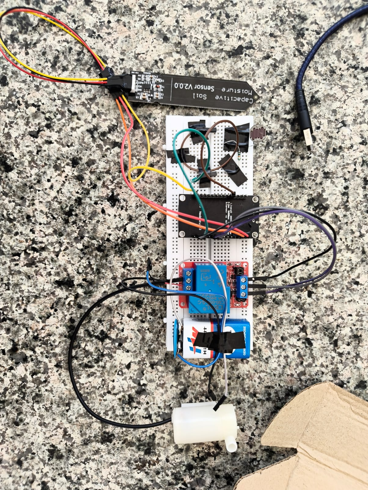
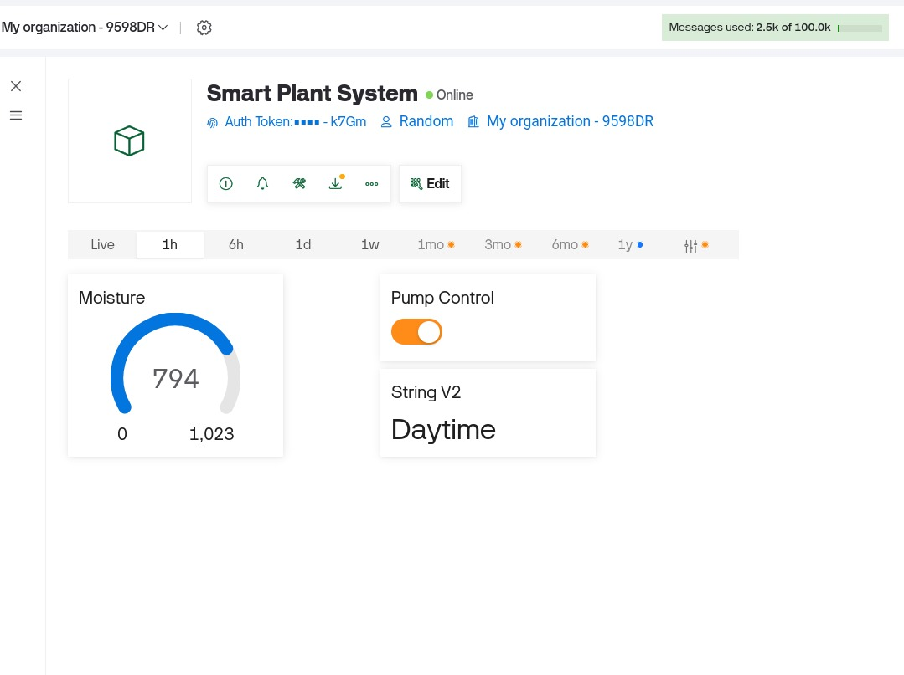
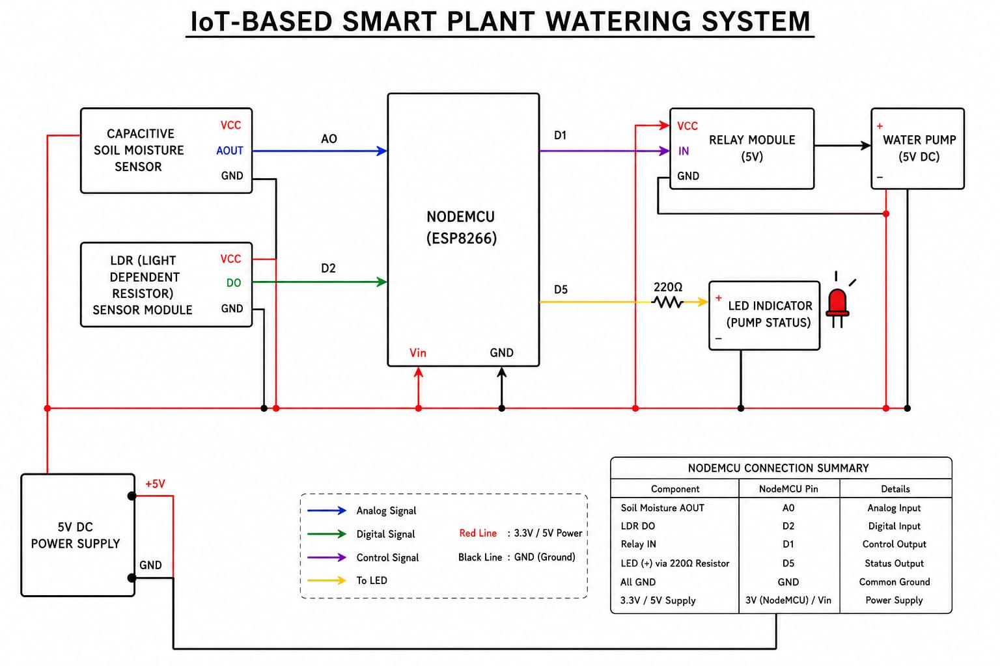
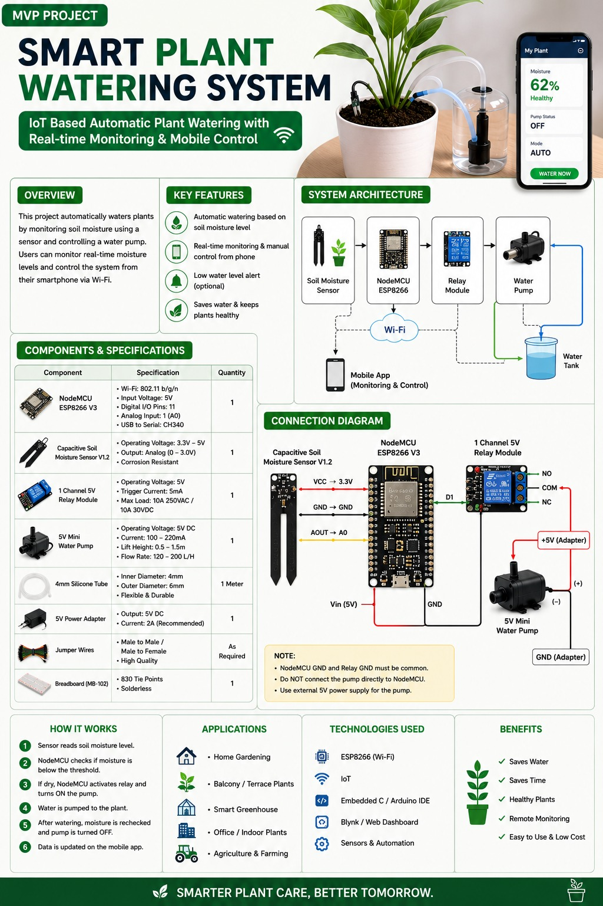

# smart-plant-watering-system-iot
# 🌱 IoT-Based Smart Plant Watering System

An IoT project that automatically monitors soil moisture and controls a water pump using an ESP8266 NodeMCU and Blynk Cloud.

## Features

- Automatic irrigation based on soil moisture
- Remote monitoring using the Blynk app
- Manual pump control
- Pump status LED indicator
- Day/Night detection using Internet time (NTP)

## Hardware Used

- ESP8266 NodeMCU
- Capacitive Soil Moisture Sensor
- Relay Module
- 5V Water Pump
- LED Indicator
- Power Supply

## Software Used

- Arduino IDE
- ESP8266 Board Package
- Blynk IoT
- Git & GitHub

## Project Structure

```
code/
docs/
images/
```

## Screenshots

### Hardware Setup


### Blynk Dashboard


### Block Diagram


### Project Poster


## Demo

The system automatically:

- Reads soil moisture.
- Turns the water pump ON when soil is dry.
- Turns the pump OFF when moisture is sufficient.
- Displays pump status on an LED.
- Allows manual control through the Blynk IoT app.

## Tech Stack

- ESP8266 NodeMCU
- Arduino IDE
- C++
- Blynk IoT
- Git
- GitHub
  
## Author

Anish Joglekar
